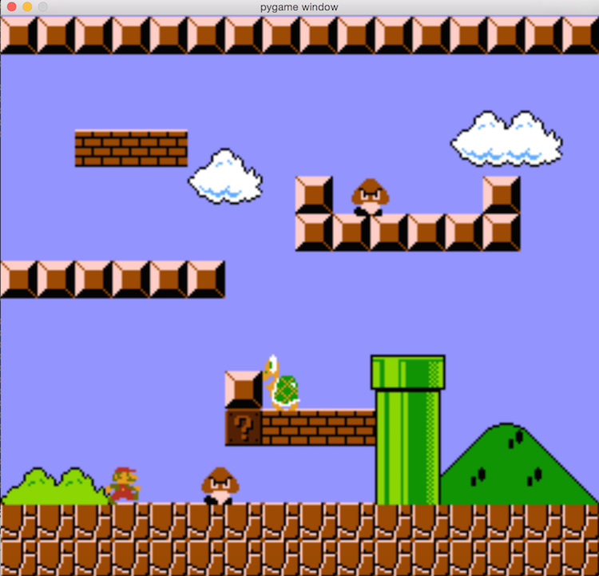

Notes for python Super Mario project
=====

How to run on Windows 7
----
1. Download & install python 2.7.10 [here](https://www.python.org/downloads/)
2. Download & install pygame 1.9.1 [here](http://pygame.org/ftp/pygame-1.9.1.win32-py2.7.msi)
3. Install python package gameobjects. In windows cmd, run "easy\_install gameobjects". Gameobjects source code is on google code site. If you cann't access them, you can also install with the one gameobjects/gameobjects-0.0.3.win32.exe.
4. Download all the project files. Then go to the directory in windows cmd, issue "python super\_mario.py"

Develop notes on Mac
----
Do the following to install virtual python env
1. source virtualenvwrapper.sh
2. mkvirtualenv pygame\_sdl2
Virtual env pygame\_sdl2 setup details could be found on https://github.com/renpy/pygame\_sdl2

Screenshots
----

Development Notes
=====

2015/07/24
-----

Super Mario is a great game. I've ever tried to make a C copy of it, but
utimatly failed, because too many infrastructures were needed, and it's really
time consuming. Now with python armed, I plan to try again. However, I'm not
sure how far away I can go, and whether I can copy this great game with python.
I've to go to office during the day, and study knew knowledge at night. So no
much time could be spent on this project. Also this game is full of details.
It's challenging to present them all.

Obviously, making such a copy is absoultely of no bussiness value. But it's a
good chance to strengthen my programming skills, also to prove it to others.
I'll start the job today, hope I can achieve the final goal.

At last, my endless admire to those who created Super Mario 30 years ago. They were
really innovative. Now let's just do it, and bear in mind, the best or nothing.

2015/08/06
----
Recently something terrible happend that could event kill the whole project. I found out that on Mac, game window's refresh time is too long, like 30ms for a 512x480 size window.(No such issue on Windows) User experience could be a nightmare in that way. And after some time on investigation, it turned out the pygame's library API surface.flip() eaten most of the cpu time(at least 90%). Then I tried to dig more, since this python API is only a wrapper of corresponding SDL's. I built a XCode app using SDL and found the same fault. At a sudden, I felt like it's hard to continue on this project.
Later, I searched for answers on Google, and find this [website](http://sdl.beuc.net/sdl.wiki/FAQ_MacOS_X_Windowed_Mode_is_slow). Seems like it's a known issue for SDL1.x version.
Then I tried to find pygame built on SDL2.x, and fortunately met with [this github project](https://github.com/renpy/pygame_sdl2). Now I'm working upon this library, and the performance issue is gone.
Glad to see that the project could be continued.
